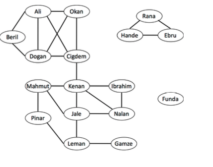

# Adj-List-Graph

Implement a simple friendship network. Represent this friendship network by a graph and answer the queries, each of which corresponds to calling a member function, on this graph.

The details of the member functions are as follows:\
**§ FriendNet(const string fileName);**\
The default constructor loads a friendship network from an input file called fileName. The first row of this file indicates the number of people in the network and each subsequent row includes information of a particular person. This information contains <id> <name> <degree> <friend_id> tokens separated by white space. For a particular person P,
- <id> and <name> are the id and the name of person P, respectively.
- <degree> is the number of friends of person P.
- <friend_id> is the id of a friend of person P. Note that a person may have zero or more friends and there will be exactly <degree> friend ids after the degree token.
 

In this assignment, you may assume that the contents of the input file are always valid. You may also assume that the ids and the names are unique and the ids are in the range of 0 and N – 1, where N is the number of people in the network. You may also assume that all names are case sensitive and do not contain any spaces, e.g., John Doe is written as JohnDoe in the file.

Note that, if the input file fileName does not exist, then the default constructor creates an empty friendship network.

As an example, the table shown on the left is an input file for the network illustrated on the right. This file contains 17 people, as indicated in its first line. For example, the fifth line of this file indicates that the person with an id of 3 has the name of Dogan and has four friends, with the ids of 14, 0, 1, and 2.

```
17
0 Ali 4 1 14 3 2
1 Beril 2 0 3
2 Cigdem 4 10 14 0 3
3 Dogan 4 14 0 1 2
4 Ebru 2 16 7
5 Funda 0
6 Gamze 1 11
7 Hande 2 16 4
8 Ibrahim 2 10 13
9 Jale 4 12 11 13 10
10 Kenan 5 2 13 12 8 9
11 Leman 3 15 9 6
12 Mahmut 3 10 9 15
13 Nalan 3 8 10 8
14 Okan 3 2 0 3
15 Pinar 2 12 11
16 Rana 2 4 7
```




**§ void listFriends(const string personName, const int hopNo);**\
It lists the names of all people that are accessible from a given person, whose name is personName, within the given number hopNo of hops (i.e., using at most hopNo edges). If this given person does not take place in the friendship network, give a warning message. If the given number of hops is non- positive, do not list any people. See the output example below for the format. You may assume that the names are unique within the friendship network.

**§ void displayAverageDegrees();**\
It calculates and displays the average degree of each connected component within the friendship network. The degree of a vertex is defined as the number of its neighbors. The average degree of a connected component is the mean of the degrees computed for every vertex in this connected component. See the output example below for the format.

**§ void displayDiameters();**\
It calculates and displays the diameter of each connected component within the friendship network. The diameter of a connected component is the longest of the shortest paths between any pair of vertices within this connected component. See the output example below for the format.
    
Below is an example test program that uses this class and the corresponding output. This test program uses the friendship network illustrated above. Assume that the name of the input file is “friends.txt”. Of course, use other programs to test your implementation.

```c
#include <iostream>
using namespace std;
#include "FriendNet.h"

int main() {
   FriendNet F("friends.txt");
   F.listFriends("Selim", 2);
   F.listFriends("Funda", 1); 
   F.listFriends("Cigdem", -1);
   cout << endl;
   F.listFriends("Ibrahim", 2);
   F.listFriends("Ibrahim", 3);
   cout << endl;
   F.displayAverageDegrees();
   cout << endl;
   F.displayDiameters();
   cout << endl;
   return 0; 
 }
 ```
The output of this program will be as follows.

```
Selim does not exist in the network.
People accessible from Funda within 1 hops: NOBODY People accessible from Cigdem within -1 hops: NOBODY
People accessible from Ibrahim within 2 hops: Cigdem, Jale, Kenan, Mahmut, Nalan People accessible from Ibrahim within 3 hops: Ali, Cigdem, Dogan, Jale, Kenan,
Leman, Mahmut, Nalan, Okan, Pinar

There are 3 connected components. The average degrees are:

For component 0: 3.08
For component 1: 2.00
For component 2: 0.00

There are 3 connected components. The diameters are:
For component 0: 6
For component 1: 1
For component 2: 0
```
